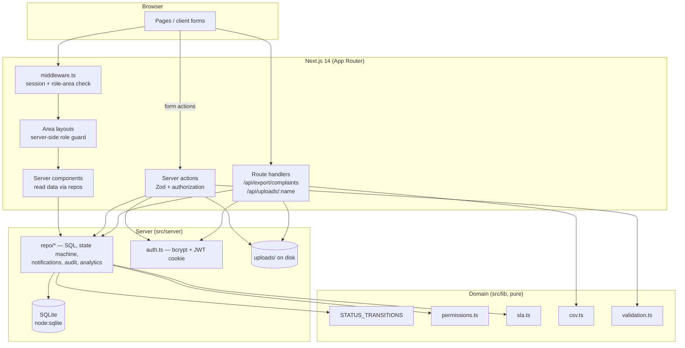
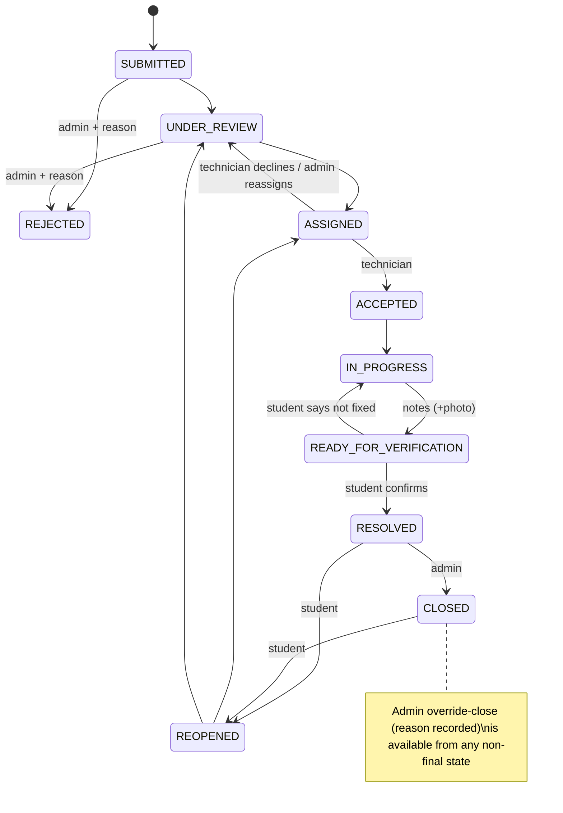

# Architecture

## Complaint lifecycle

## Layers and responsibilities
* **Pages** are server components; interactive parts are small client components (`src/components/**`).
* **Actions** (`src/server/actions`) — the only mutation entry points: validate (Zod) → authorize → call repo → revalidate.
* **Repo** (`src/server/repo`) — SQL and business rules. `transitionComplaint()` enforces lifecycle + role/ownership,
  writes the activity log, audit log and notifications in one place.
* **Data**: `src/server/db/schema.sql` (runtime) mirrors `prisma/schema.prisma` (migration target).

## Swapping SQLite for PostgreSQL
Only `src/server/db/client.ts` and `src/server/repo/*` touch SQL. Replace them (e.g. with Prisma) and keep action/page code.
